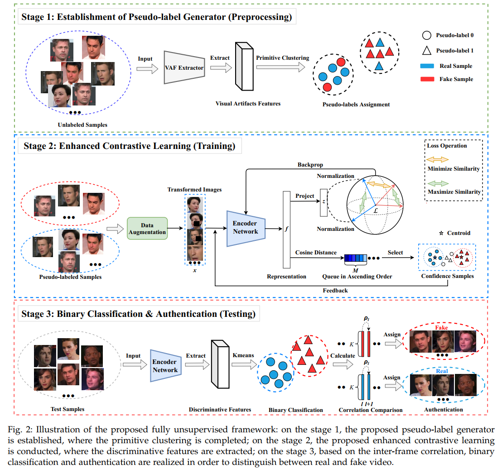

# Introduction
Trying to improve the official PyTorch implementation for the following paper:
## Fully Unsupervised Deepfake Video Detection via Enhanced Contrastive Learning

Paper link: (https://ieeexplore.ieee.org/abstract/document/10411047)

# Environment in Paper
Python==3.7.6, torch==1.10.1, torchvision==0.11.2, cudatoolkit==11.1

# Environment in my implementations
Python==3.12